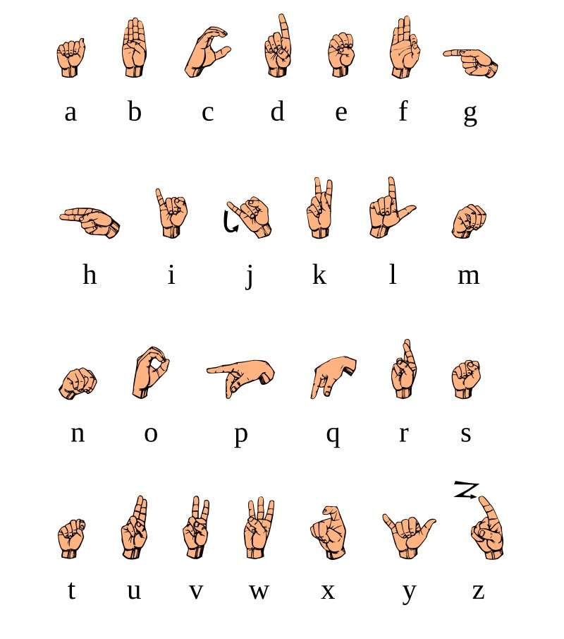

# Sign language prediction based on hand landmark using tensorflow lite.

Welcome to the Hand Landmarker Android example project! This project demonstrates how to use hand landmark detection in an Android application to predict sign language characters using a TensorFlow Lite model trained in an earlier repository.

## Table of Contents

- [Introduction](#introduction)
- [Features](#features)
- [Requirements](#requirements)
- [Installation](#installation)
- [Usage](#usage)
- [Contributing](#contributing)

## Introduction

This project showcases the implementation of hand landmark detection using machine learning models on an Android platform. It provides a real-time hand tracking experience by identifying key points on the hand and predicting sign language characters.

## Features

- Real-time hand landmark detection
- Sign language character prediction
- Easy integration with Android applications
- High accuracy and performance

## Requirements

- Android Studio 4.0 or higher
- Android device with camera support
- Minimum SDK version 21

## Installation

1. Clone the repository:
   ```sh
   git clone https://github.com/yourusername/hand_landmarker_android.git
   ```
2. Open the project in Android Studio.
3. Sync the project with Gradle files.
4. Build and run the application on your Android device.
5. You can download the apk test out the app from this [link](https://lut-my.sharepoint.com/:u:/g/personal/mahi_talukder_student_lut_fi/EZM8m7IetShMolTYPE6DPXkBfAM3Nop4aV7j66AOvOqwPA?e=d9qYmi)

## Usage

1. Launch the application on your Android device.
2. Grant camera permissions if prompted.
3. Point the camera at your hand to see real-time hand landmark detection and sign language character prediction.
4. Sign language chatachters for practice:
   

## Contributing

We welcome contributions to improve this project! Please follow these steps to contribute:

1. Fork the repository.
2. Create a new branch (`git checkout -b feature-branch`).
3. Make your changes and commit them (`git commit -m 'Add new feature'`).
4. Push to the branch (`git push origin feature-branch`).
5. Open a pull request.
